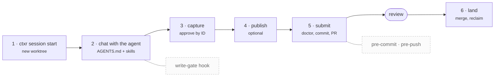

# Contexture (`ctxr`)

[](https://www.npmjs.com/package/ctxr-cli) [](https://github.com/ayxuerui/contexture/actions/workflows/ci.yml) [](LICENSE)

**Your agents' long-term knowledge — they write it, you review it before it lands.**

Contexture turns a git repository into shared, durable knowledge, and ships the operating procedures an AI agent needs to work it: what to do with a new source, where a note belongs, when a synthesis has gone stale, how a change gets reviewed and landed. Every write lands the way code does — in a branch, past a health check, through a pull request you approve.

This is one layer of agent memory — the shared one. Your harness keeps what an agent knows about you and itself; contexture keeps what *you* know, reviewed and versioned, outliving any single agent or session. Claude Code, Codex, Cursor, Cline, Gemini CLI, a cron job, or you at a terminal all operate the same store through the same files.

A **store** is an ordinary git repository: markdown notes joined by `[[wikilinks]]`, with `contexture.yaml` as the single source of truth for how that particular store is shaped — its taxonomy, its paths, its relation vocabulary. `ctxr` is a mechanism-only CLI over it — it builds indexes, enforces invariants, and performs validated writes, but it makes no editorial decisions. The judgment lives in **skills**: portable markdown decision procedures that `ctxr init` installs into the store, which whatever agent you're talking to reads and follows. That split is the whole design, and it's what makes the same store operable from any harness.

## Install

```sh
npm install -g ctxr-cli
```

Requires Node 22.13 or newer.

The package is `ctxr-cli`, the command it installs is `ctxr`, and the project is Contexture — which is why a store’s own files keep the full name (`contexture.yaml`, `.contexture/`, `CONTEXTURE_*`). A `contexture` alias executable is installed too; docs and generated files always say `ctxr`.

## Quickstart

```sh
mkdir my-store && cd my-store
ctxr init
ctxr adapters generate   # writes the harness entry file (CLAUDE.md) and its permission config
```

`ctxr init` asks two questions, then creates the git repository (if there isn't one), scaffolds the store, and commits it:

- **Which taxonomy profile?** `para` (Projects / Areas / Resources / Archives — the default), `zettelkasten` (no layers at all; structure emerges from links), or `diataxis` (Tutorials / How-to / Reference / Explanation). Or bring your own layer list with `--taxonomy <file.yaml>`.
- **Which agent harnesses?** `claude-code` (default — its adapter generates `CLAUDE.md` plus a `.claude/settings.json` wiring up the write-gate hook) and/or `hermes-agent` (reads `AGENTS.md` directly, so it needs no entry file at all). `--harness none` opts out.

Harness adapter output is the one part `init` doesn't write itself, which is why `ctxr adapters generate` is a separate line above; `ctxr update` regenerates it from then on.

Non-interactively, pass them as flags — nothing ever blocks on a prompt:

```sh
ctxr init --profile para --harness claude-code
```

`init` is idempotent. Re-running it against an existing store reconciles it instead (the same code path as `ctxr update`) rather than overwriting anything.

## What a store looks like on disk

After `ctxr init --profile para`, plus `ctxr adapters generate`:

```
contexture.yaml               single source of truth — what this store chose; the rest takes shipped defaults
AGENTS.md                     generated entry document — six managed sections
CLAUDE.md                     harness entry file; a one-line managed import of AGENTS.md
.claude/
  settings.json               PreToolUse hook wiring for the write gate
  hooks/                      the write-gate shim
  skills/ -> ../.agents/skills   a bridge, so Claude Code auto-discovers the canonical skills
.agents/skills/               THE canonical skills location, read natively by most harnesses
  ctxr-*/SKILL.md               13 contexture-owned skills (refreshed by `ctxr update`)
  frontend-design/, eli5/       vendored third-party skills, with licenses and provenance
.contexture/guidance/
  house-conventions.md        your store's own rules — inlined into AGENTS.md verbatim
  mission.md                  the standing "what's active right now" document
.githooks/
  pre-commit                  runs `doctor --staged`
  pre-push                    refuses a push to the default branch
projects/ areas/ resources/ archives/     the taxonomy's layers
raw/inbox/                    where captured material lands, before ingest
```

These appear the first time they're needed rather than at init:

```
raw/<YYYYMM>/                 retained captures, one directory per month of ingest
.contexture/catalog/*.md      one section per layer, plus uncategorized — tracked in git
.contexture/publish/          published pages
.contexture/cache/            gitignored — graph.json and the human-readable graph.md
.worktrees/                   gitignored — session worktrees
```

Two distinctions make the rest of this readable:

**Derived vs. authored.** Never hand-edit inside a `contexture:<region>` fence — the next build overwrites it. Edits *outside* a fence survive every rebuild, and that's where they belong: the catalog generates each note's entry line but preserves the one-line gloss you write next to it, forever.

**`.contexture/` is not content, and neither is `raw/`.** The store's own home directory, the skills directory, and the worktrees path are excluded from every retrieval leg by default (`retrieval.exclude_paths`), so the store's plumbing never shows up as an answer to a question about the store's subject matter. `raw/` — the capture tier — is excluded for a different reason: what arrived is not yet what you know. It is tracked in git all the same, because a retained capture is the provenance behind a note.

## How agents drive it

`ctxr init` writes two things an agent reads, both generated from your store's own config — never from a hardcoded layout:

**`AGENTS.md`**, with six managed sections: *Store fundamentals* (root resolution, the frontmatter schema, the write path), *Mission*, *Retrieval: which leg to use*, *Capturing and ingesting*, *Placing a new note* (rendered from your actual taxonomy layers), and *Store conventions*.

**The skills**, installed as full copies at `.agents/skills/ctxr-<name>/SKILL.md`. That path is the cross-harness canonical location; a harness that reads its own branded directory instead gets that directory bridged to it (`.claude/skills/` is a symlink), so skill auto-discovery works with no wrapper and no second copy. A harness without auto-discovery reaches the same file by path from `AGENTS.md`. They're contexture-owned — refreshed by `ctxr update`, never hand-edited — and they're written against *your* store's configured taxonomy and relation vocabulary, so no shipped profile's layer names leak into them. Your own skills live alongside, untouched by sync.

| Skill | What it decides |
| --- | --- |
| `ctxr-ingest-orchestration` | What the store should know after a source — not where to file it |
| `ctxr-placement` | Which layer and location a note belongs in, and why |
| `ctxr-connection-finding` | Traversing links that already exist |
| `ctxr-connection-proposal` | Discovering links a note *should* have |
| `ctxr-rollup` | Synthesizing an entity's current state from every note referencing it |
| `ctxr-mission` | Keeping the store's priorities / back burner / debt document current |
| `ctxr-organize-audit` | Placement review, retiring, classifying broken links |
| `ctxr-derived-artifacts` | Rebuilding catalog, graph, and generated docs without clobbering them |
| `ctxr-publish` | Whether a subject earns a page, and what may appear on it |
| `ctxr-session-lifecycle` | Starting a session, re-scanning, conflicts, sequencing several PRs |
| `ctxr-submit` | Everything up to and including opening the pull request |
| `ctxr-land` | Merging after review, and reclaiming the worktree |
| `ctxr-session-capture` | What a finished session produced that is worth keeping |

Your house rules go in `.contexture/guidance/house-conventions.md`. It's inlined into `AGENTS.md`'s *Store conventions* section in full, so it loads for every harness at the start of every session — there's no separate file an agent has to remember to open.

## A session, end to end

This is the loop you actually live in: start a session, talk to the agent, publish, submit, land.




**1. Start.** `ctxr session start` creates a git worktree on a generated `session/…` branch off a freshly fetched `origin/<default-branch>`, and prints its path:

```
Session worktree at "/path/to/my-store/.worktrees/session-20260903-060120-5ccbd6"
on branch "session/20260903-060120-5ccbd6" (from master).
```

With no remote configured it falls back honestly to the local branch tip rather than failing. `cd` there and open your agent. Never work in the canonical clone — `ctxr session list` shows what's active. (The default branch is whatever `git init` actually created, recorded once at init; nothing hardcodes `main`.)

**2. Chat.** Your harness loads `AGENTS.md` — or `CLAUDE.md`, which imports it — at session start, and discovers the skills through the bridged directory. Describe what you want in plain language: *"read this article and file it"*, *"what do we know about Acme"*, *"roll up this entity"*, *"make me a page comparing these three"*. The agent picks the skill. There's nothing to memorize; the [knowledge loop](#the-knowledge-loop) below is what it runs on your behalf, documented for when you want to drive a step yourself.

**3. Wrap.** On *your* closing signal — "done", "ship it", a sign-off; never the agent's own summary — `ctxr-session-capture` fires exactly once. It proposes, in a single message with IDs, what the session produced that is durable, split by kind: a **fact** about what happened becomes a store note, a **rule for future work** becomes a house convention. Nothing is written until you approve by ID. Approved notes go through:

```sh
ctxr session capture --proposal approved.yaml
```

```yaml
notes:
  - id: A1
    path: resources/Acme.md
    mode: create          # or: append
    frontmatter:
      title: Acme
    body: |
      # Acme
```

Each item is validated and applied independently, so one bad path refuses that item alone rather than the whole proposal. Approved *conventions* aren't notes — they're a direct edit to `house-conventions.md` followed by `ctxr update`, staged in the same commit. (A guidance edit without the matching `AGENTS.md` regeneration fails `doctor --staged`, and the pre-commit hook refuses it.)

**4. Publish**, if the session earned a page. Run it before submit so the page rides the same pull request. See [Express](#5-express--publish-a-page) below.

**5. Submit.** `ctxr-submit`: re-scan git state (never replay a plan from an earlier snapshot), run the capture pass, stage surgically with `git add <paths>` — never `-A`, and derived cache paths never stage — then `ctxr doctor` over the whole store, not `--staged`: a session's job is to leave the *store* healthy, not merely to pass one commit's gate. Then commit, rename the generated branch to something meaningful before it reaches the forge, `git push -u origin <branch>`, and `gh pr create`. If `gh` has no reachable GitHub remote, the push still succeeds on its own and you get manual pull-request instructions instead of a retry loop.

**6. Land.** `ctxr-land`, after review: name the pull request explicitly rather than inferring it from whichever checkout you're standing in, read its state and mergeability with `gh pr view`, then wait for an explicit go — plan consent is not fire consent. `gh pr merge --squash`, then re-read state to confirm the forge reports `MERGED`; a transport error can arrive after a merge already succeeded, so the exit code alone is never enough. Finally fast-forward the canonical clone (`git fetch origin && git merge --ff-only`) and reclaim the worktree (`git worktree remove`, `git branch -d`) — nothing sweeps up afterward, so a worktree left here is left indefinitely.

`ctxr-session-lifecycle` covers what surrounds both halves: when to re-scan, the conflict playbook, and sequencing several pull requests.

### Why steps 5 and 6 aren't CLI commands

They're ordinary `git` and `gh`. The CLI owns only what git cannot do — creating the worktree, applying validated note writes, running the health gates — and the sequencing, the confirmation gates, and the judgment live in the skills, where you can read and change them. That's why `ctxr session` has exactly three subcommands: `start`, `capture`, and `list`.

Three mechanical backstops hold the line underneath all of it: the **pre-commit** hook runs `doctor --staged`; the **pre-push** hook refuses a push to the default branch (`CONTEXTURE_ALLOW_DEFAULT_BRANCH_PUSH=1` is the emergency override, for emergencies); and for Claude Code the **write-gate** PreToolUse hook denies any edit under the store root made outside the active session worktree.

## The knowledge loop

What the agent is doing inside step 2 — and how to drive any of it by hand.

Four of these are the moves knowledge work is made of: **capture** what arrives, **organize** it so it stays navigable, **distill** it into something that answers a question, **express** it for a reader who wasn't there. Retrieval isn't a stage — it's what makes the other four worth doing — but it sits second here because it's the one you reach for constantly.

### 1. Capture — get material in without duplicating it

Capture is just writing the material into `raw/inbox/`; no CLI wraps it. It may already carry `source_type` and `source_id` — whatever fetched it usually knows them — but never `source_hash` or `ingested`, which contexture assigns once, at ingest. Then:

```sh
ctxr source check raw/inbox/note.md --source-id https://example.com/a
# ...read the cluster, decide, write or extend the note...
ctxr ingest raw/inbox/note.md --into resources/topic.md --source-type article --source-id https://example.com/a
```

`source check` returns one of five verdicts: `new`, `already_ingested`, `drift` (same source, its content moved — read what changed before deciding), `alternate_source_match` (this content is already here under a different identity), or `multiple_matches` — which exits non-zero and means *stop and resolve the ambiguity yourself*, never guess which existing record it is. URLs are canonicalized first, with tracking parameters stripped (`ingest.tracking_params`). `ctxr source stamp` backfills a record with no hash on file; `ctxr source add-alt` records material re-published at a new URL, rather than ingesting it twice.

`ctxr ingest` stamps the four identity fields **onto the capture**, moves it out of the inbox into `raw/<YYYYMM>/`, records its path in the destination note's `sources` list, and rebuilds the catalog. The note carries no source identity of its own, which is what lets it be rewritten, merged or restructured without invalidating the frozen hash — and what lets one note cite the several captures it was built from. `--into` is required: ingest never creates the note, because deciding what the store should know is the work.

Material that isn't markdown can't carry frontmatter, so it travels with a markdown sidecar naming it in `capture_file`; the hash is taken over that file's bytes and the two move together.

The commands are the easy part. `ctxr-ingest-orchestration` exists because ingest is **synthesis, not filing** — "create a new note" is one option among several, and the skill's decision table (new note / expand an existing one / merge two / restructure / add a section to a hub) is the actual work. Every row of that table ends in the same `ingest` call, so provenance is recorded whichever one you take. `ctxr-placement` decides where the result lives, and says why.

### 2. Retrieve — three legs, no ranker

```sh
ctxr catalog show --section projects      # curated index, one section per layer
ctxr graph build                          # then query it, or read .contexture/cache/graph.md
ctxr graph query neighbors <path> --depth 2
ctxr graph query hubs
ctxr graph query orphans
```

The **catalog** is coverage-guaranteed: every retrievable note has exactly one section, so nothing is silently unindexed. Section ids are your layer paths plus `uncategorized` (or a single `notes` section under a zero-layer profile). The **graph** enumerates structure and ranks nothing — neighbors, shortest path, hubs, clusters, bridges, orphans; `--type <relation>` follows one configured relation. `graph build` also writes a human-readable `graph.md` summarizing hubs by cluster. The third leg is **your own grep**, for literal strings the first two can't answer, scoped to exclude `.contexture/`.

There is no `ctxr search`, and no semantic ranking. That's deliberate, not missing.

→ `ctxr-connection-finding` (traverse what exists), `ctxr-connection-proposal` (discover what should).

### 3. Organize — keep it navigable as it grows

```sh
ctxr lint          # observations — orphans, broken links, material still in the inbox; always exits 0
ctxr doctor        # invariants — exits non-zero, and gates every commit
ctxr catalog check --stale
ctxr archive <path>
```

The `lint` / `doctor` split is the point: lint reports what's *worth reviewing* and never blocks; doctor reports what's *broken* and does. `ctxr archive` retires a note as a single tracked rename into `organize.archive_destination`, leaving its frontmatter byte-identical and reporting every note that linked to it — move it, don't tag it, or the active layers stop meaning anything. (The note must be committed first; archive won't rename something git isn't tracking.)

→ `ctxr-organize-audit`, `ctxr-derived-artifacts`.

### 4. Distill — rollups and the mission document

```sh
ctxr rollup stale                                   # entities whose backlinks moved since last synthesis
ctxr rollup gather <entity>                         # enumerate the source notes
ctxr rollup write <entity> --content-file draft.md  # idempotent fenced write
```

Gather and write are deterministic; the synthesis in between is the agent's, over *every* source rather than a sample. The write only ever touches the fenced region — hand-written content elsewhere in the note is never disturbed, and re-writing identical content reports `changed: false` and leaves the file byte-identical.

The store's own `.contexture/guidance/mission.md` uses the same write path, but is reported stale on elapsed time (`organize.rollup_stale_days`) rather than on backlinks.

→ `ctxr-rollup`, `ctxr-mission`.

### 5. Express — publish a page

```sh
ctxr publish gather --under resources/    # or --note <path>, or --entity <name>
ctxr publish new comparison               # scaffolds the page folder and its sibling README
ctxr publish check .contexture/publish/comparison
```

`gather` resolves a subject to its note set — never a hand-picked list, which is how an unintended note slips onto a page unnoticed. `check` runs the structural gates: no external references, viewport meta, a print rule, provenance, the sibling README, script syntax. What a page may *contain*, given who will read it, is a judgment `ctxr-publish` walks you through and no check can make.

→ `ctxr-publish`, plus the vendored `frontend-design` and `eli5` skills for the craft contexture supplies none of.

## Reading a store in a browser

```sh
ctxr serve
```

Renders notes, catalog sections, the graph document, and published pages as cross-linked HTML. It binds loopback (`127.0.0.1`) by default. `--host` widens that, but note what it does not change: `serve` applies **no per-requester filtering at any bind address**. Widening it exposes the whole store to whatever can reach that address, so only do it behind a front end you've arranged yourself.

A published page's navigation label follows its own declared `<title>`, falling back to its folder name when it declares none. The header's light/dark/system links choose a display theme, and the ☰ control shows and hides the navigation — both persist across pages via cookies, and neither requires client-side script. A published page itself is still served byte-verbatim, so neither the theme nor the navigation reaches into it; `ctxr publish new`'s scaffold instead follows the viewer's own system preference on its own.

## Keeping a store current

```sh
ctxr version           # the installed version, and where it is installed from
ctxr version --check   # compare it against the latest published release
ctxr update            # refresh every contexture-owned file to the installed version
ctxr migrate --dry-run # report what pending schema migrations would change
ctxr migrate
ctxr verify --portable # prove the store works from a harness with no harness-specific state
```

`ctxr update` re-renders the `AGENTS.md` sections, skill copies, hooks, and adapter outputs — run it after upgrading the CLI, and after editing your house conventions.

### Upgrading the CLI

`ctxr session start` and `ctxr update` check whether a newer release has been published and say so, once per session and once per update. The notice goes to stderr and appears as an `info` finding in `--json` output; it never changes either command's exit code, and a registry that is slow, unreachable, or behind a proxy simply produces no advice rather than a failure. `ctxr doctor` and `ctxr init` never make the request at all — a commit must not depend on the network, and `init` stays offline.

The `ctxr-upgrade` skill performs the upgrade: it reads the live answer, refuses to instruct a global install when the executable it finds is a linked working copy, asks before changing anything, and re-renders the store *after* the package upgrade rather than before. By hand, that is `npm install -g ctxr-cli@latest` followed by `ctxr update`, in that order.

To turn the check off, set `update_check.enabled` to `false` in `contexture.yaml`, or set `CONTEXTURE_UPDATE_CHECK=0` for a single invocation. `update_check.ttl_hours` sets how long a resolved answer is reused (a day by default); the cache lives in the store's gitignored `.contexture/cache/`.

`schema_version` in `contexture.yaml` versions *store state* — the config shape and frontmatter conventions — as a monotonic integer independent of the npm package version. A store recorded at a newer schema than your CLI supports is refused rather than half-read.

### The config records decisions, not values

A generated `contexture.yaml` is short, and that's the design: **any key it doesn't declare takes contexture's shipped default.** So everything the file *does* contain is a choice someone made, and a store that simply agrees with a convention follows it as the convention improves — a later release that changes a shipped default reaches every store that never overrode it, with no migration.

Three kinds of key are always written out, because no constant could be right for them:

- **Store facts** — `taxonomy`, and `git.default_branch`, which records whatever branch your repository actually uses rather than a guess.
- **Taxonomy-derived** — `organize.archive_destination`, resolved from the profile at init. Defaulting it to a flat constant would send a PARA store's archived notes to `archive/` while its own taxonomy declares `archives/`.
- **Opt-ins** — `organize.mission_path`, where *not* declaring the key is what says the store has no mission document.

To pin a value against a future default change, declare it. `ctxr migrate` removes keys that merely restate a default; it never changes what any key resolves to.

## Command reference

| Command | What it does |
| --- | --- |
| `init` | Create a store, or reconcile an existing one |
| `doctor [--staged]` | Check real invariants; non-zero on any failure |
| `lint` | Health observations; always exits 0 |
| `catalog build \| check \| show` | Build, verify coverage, print a section |
| `graph build` | Rebuild the wikilink graph and its document |
| `graph query …` | `neighbors`, `path`, `subgraph`, `hubs`, `clusters`, `bridges`, `orphans` |
| `ingest <path> --into <note>` | Retain a capture with its source identity, and cite it from a note |
| `source hash \| check \| stamp \| add-alt` | Dedupe and source identity, ahead of ingest |
| `archive <path>` | Retire a note via one tracked rename |
| `entry append <path>` | Append a line into a `contexture:<region>` fenced region |
| `rollup gather \| write \| stale` | Entity synthesis: enumerate, write, find what's out of date |
| `publish gather \| new \| check` | Resolve a subject, scaffold a page, run the structural gates |
| `session start \| capture \| list` | Session worktrees, and applying an approved capture proposal |
| `adapters generate \| write-gate` | Regenerate harness outputs; the write-gate hook target |
| `serve` | Read the store in a browser |
| `update` | Bring contexture-owned files up to the installed version |
| `version [--check]` | Report the installed version; `--check` compares it against the latest published release |
| `migrate [--dry-run]` | Apply pending schema migrations |
| `verify [--portable]` | Exercise core store operations end to end |

Every command accepts `--root <path>`, `--json`, and `--no-input`. The store root resolves in exactly one order: `--root`, then `CONTEXTURE_ROOT`, then walking up from the current directory looking for `contexture.yaml`. Nothing else selects it.

Exit codes are a fixed taxonomy, so scripts and hooks can rely on them: `0` success, `1` an internal error (a bug), `2` a usage error (bad arguments, no store root, not a git repository), `3` a check that ran correctly and found a real problem. Success never masks a finding — `doctor` and `catalog check` exit `3` on a violation, never `0`.

## Contributing

Build, test, the spec-first workflow, and the release process are in [CONTRIBUTING.md](CONTRIBUTING.md). Contexture is MIT licensed — see [LICENSE](LICENSE).
